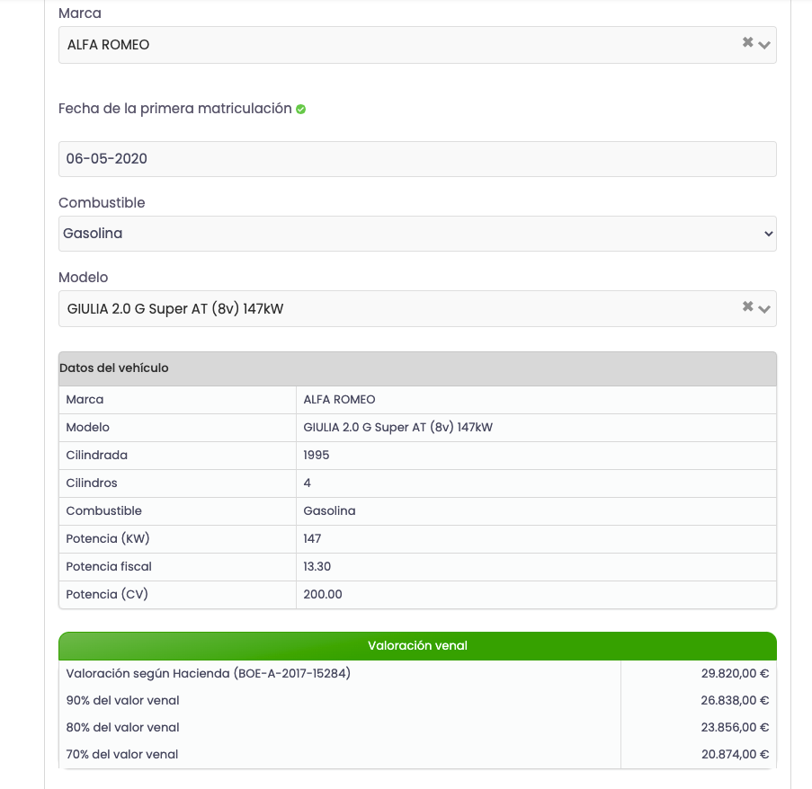

# Entry task

##### API
```javascript
https://api-sandbox.swipoo.com/v1/check-car-models
```

##### DOCS

```javascript
https://api-sandbox.swipoo.com/docs/
```

##### Exercise

With the provided API and documentation, we'll create a very simple UI platform with 2 screens that allows users to:

Screen 1:
- Input the necesary information to be able to select a car model and load its information.
- Once you have selected a car model you should be able to create a car and store it along with the name of the client.

Screen 2:
- Get and show the list of the created cars and their stored information plus new data that you need to calculate: for each year since the enrollment date, the vehicle receives 10% more depreciation applied to the standard value.

##### Notes/Hints:

> You should be able to understand which fields you need by checking our documentation and understanding what each endpoint needs.

> You can use the technology you feel more confortable with, but we recommend React.

> It's important to have good UI and good UX since we'll evaulate that for this frontend position, as well the structure of the project and the use of good practices.

> Since this is a Frontend position you don't need to create any kind of backend to store the data of the created cars, you have multiple ways to do so only in the client side :) 

##### Example

This picture should help you understand what you need and get into context, but think wider that just that UI.




If you have any question don't hesitate to send an email at [engineering@swipoo.com](mailto:engineering@swipoo.com)
